# Module 4 Lesson 1- Lab 2A: Azure Health Bot

## Overview

The Azure Health Bot Service is a cloud platform that empowers developers in healthcare organizations to build and deploy their compliant, AI-powered Patient insights and health bots, that help them improve processes and reduce costs. It allows you to offer your users intelligent and personalized access to health-related information and interactions through a natural conversation experience.

With the service, healthcare organizations can build a "health bot instance" and integrate it with their systems that patients, nurses, doctors, and other representatives interact with. Building an instance allows you to:

-   Improve processes
-   Improve services
-   Improve outcomes
-   Reduces cost

The Health Bot Service contains **a built-in medical database**, including **triage protocols**. You can also extend a health bot instance to include your own scenarios and integrate with other IT systems and data sources. To learn more about Azure Health Bot, see [Azure Health Bot Overview](https://docs.microsoft.com/en-us/azure/health-bot/) on Microsoft Docs.

The Azure Health Bot focuses on the Enhance patient engagement priority scenario by creating a virtual bot health option to allow for new avenues of care with embedded insights.

This lab will focus on Lamna Healthcare Company.

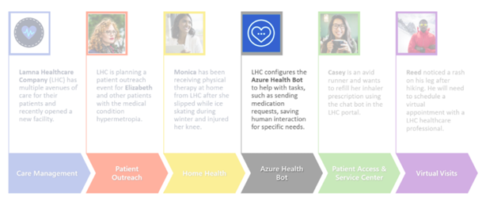

As part of their digital transformation efforts, Lamna Healthcare Company is seeking to streamline their patient engagement capabilities by implementing Azure Health Bot to help improve processes and services, such as entering medication requests. By allowing patients to interact with this service, Lamna Healthcare Company will move one step closer to their goal of improving patient outcomes while reducing overall costs.

In this lab, you'll play the role of a Lamna Healthcare IT developer and configure Azure Health Bot for a medication refill scenario.

## Learning objectives

In this lab, you will:

-   Set up Azure Health Bot
-   Configure Dynamics 365 Customer Service Omnichannel Live Chat
-   Embed Azure Health Bot in a Power Apps Portal
-   Extend Azure Health Bot with custom scenarios

## Exercise 1: Set Up Azure Health Bot

In this exercise, you will do the following:

-   Set up Health Bot from Azure Portal
-   Configure and enable the integration between Dynamics 365 Omnichannel and Health Bot
-   Configure and enable Bot channel to obtain a Bot Id

**Azure Health Bot** empowers developers in healthcare organizations to build and deploy AI-powered, compliant, conversational healthcare experiences at scale. It combines built-in medical database with natural language capabilities to understand clinical terminology and can be easily customized to support your organization's clinical use cases. The service ensures alignment with industry compliance requirements and is privacy protected to HIPAA standards. To learn more about Azure Health Bot, please reference this [Azure Health Bot documentation](https://docs.microsoft.com/en-us/azure/health-bot/).

### Task 1: Install Azure Health Bot in Azure Subscription

1. [] While logged in to your Microsoft 365 tenant, open a new tab in your internet browser incognito or in-private mode and navigate to Azure Portal at <https://portal.azure.com/>

1. [] Search for **Azure Health Bot** in the top search bar and select it from the search results.

    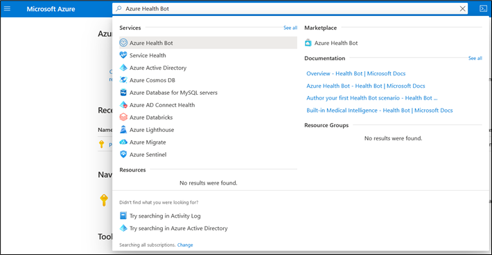

1. [] Select **Create** button to create a new Azure Health Bot instance.

    

1. [] You will be redirected to the Azure Health Bot page. Enter the following information:
    1. [] **Subscription**: +++Azure Pass - Sponsorship+++
    1. [] **Resource Group**: +++IndustryLabs+++
    1. [] **Name**: iaduser[x]-healthbot (e.g., iaduser01-healthbot, using your assigned user)
    1. [] **Region**: East US
    1. [] **Plan**: Free (F0)

        

1. [] Select **Review + Create**.

1. [] On the **Review and create** page, verify your details are correct as Azure validates your Health Bot. After validation passes, the create button will become enabled. Select **Create**.

    > [!NOTE] Note: It will take few seconds to run the backend process before the Create button is enabled.

    

1. [] You will be redirected to the **Deployment** page for your new Azure Health Bot.

    

1. [] When deployment is complete, the **Go to resource** button will enable. Please wait until deployment is complete for the Azure Health Bot, then select **Go to resource** when enabled.

    

1. [] You will be redirected to the **Resource** page for your new Azure Health Bot. Select the **Management portal** link in the Essential section to open your Azure Health Bot instance configuration page.

    > [!NOTE] Note: Please copy this Management portal link and store it to access the Health Bot later.

    

1. [] You will be navigated to your new Azure Health Bot instance homepage.

    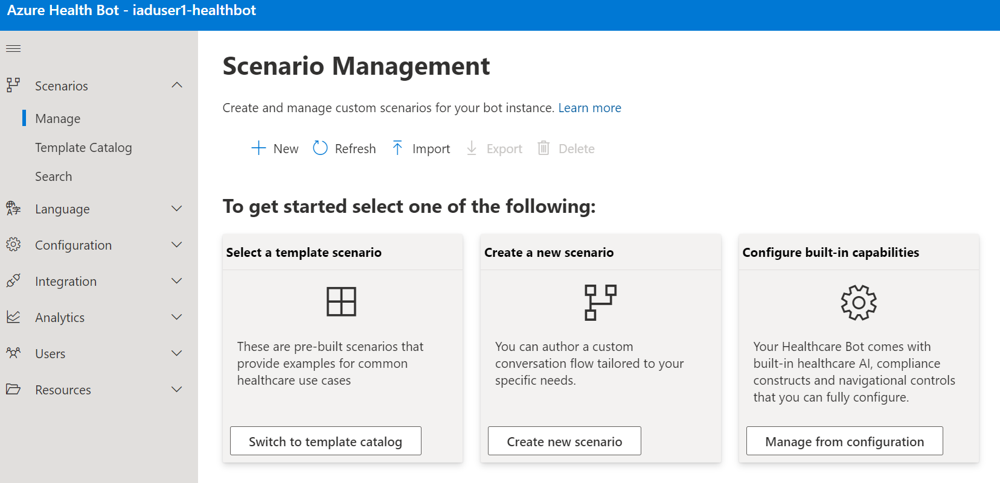

**Congratulations!** You have successfully created a new Health Bot instance in your Azure tenant.

### Task 2: Update Azure Health Bot Settings to Enable Dynamics 365 Integration

1. [] On the **Azure Health Bot** homepage, expand the side navigation bar to see the sitemap labels.

    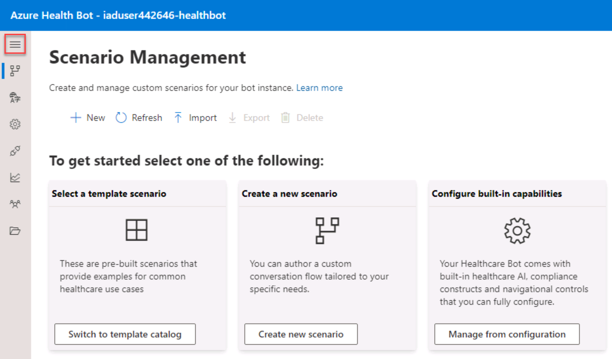

1. [] After expanding, you will see the sitemap labels next to the icons.

    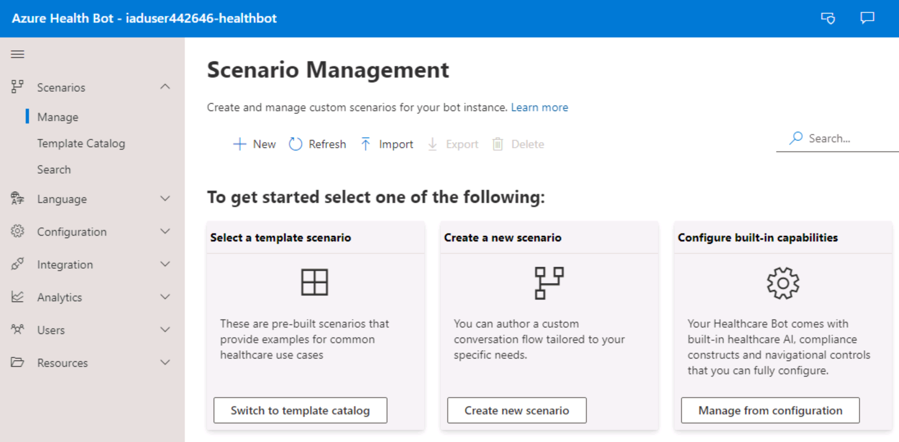

1. [] Select **Configuration > Conversation** on the navigation bar.

    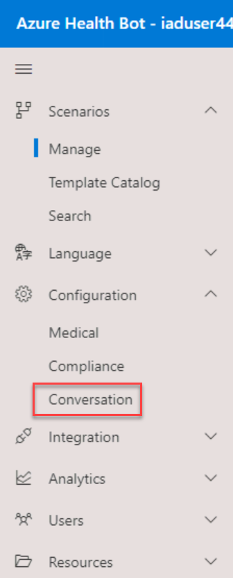

1. [] You will be landed in the **Interactions** tab.

    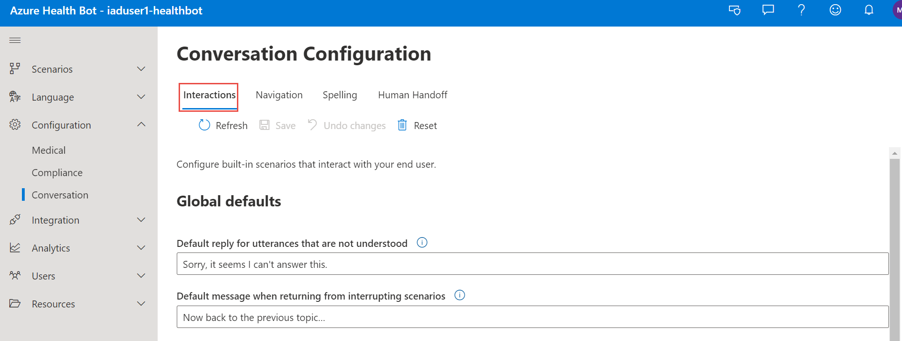

1. [] Select **Human Handoff** tab in the Conversation settings.

    

1. [] Scroll to the bottom of the **Human Handoff** page. Under **Dynamics 365 Omnichannel**, toggle **Enabled** for **Bridge Messages**. This is required to allow communication and bridge messages between the Azure health Bot and Dynamics 365 Omnichannel for Customer Service.

    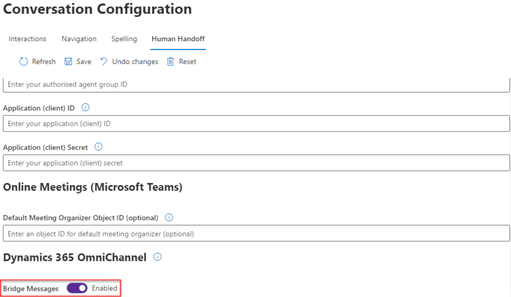

1. [] Select **Save**.
    

    Now let’s enable the Health Bot for **Microsoft Teams** Channel.

1. [] Navigate to **Integration > Channels**.

    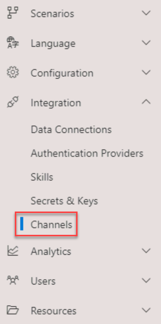

1. [] In the **Channels** list, select the toggle to **enable Microsoft Teams**.

    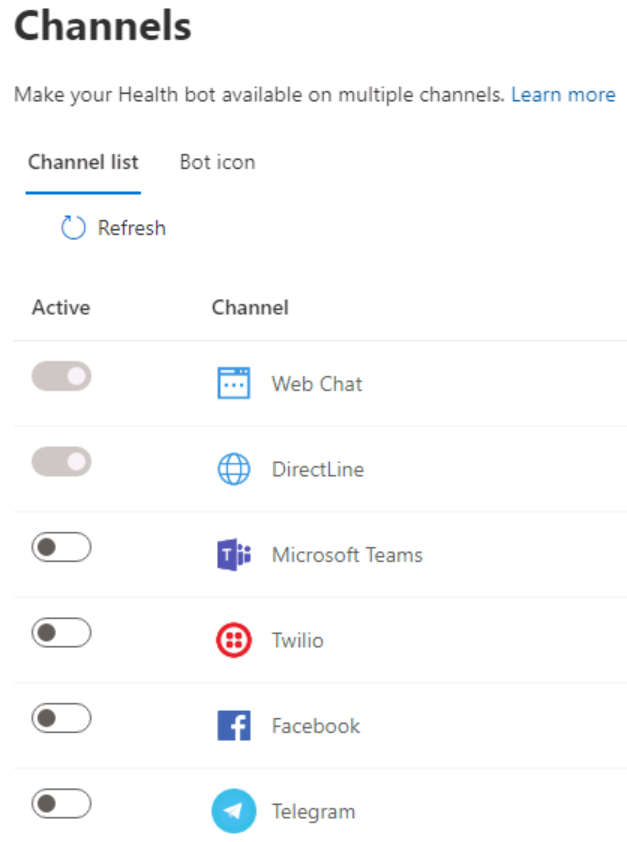

1. [] This will bring out a side window with your **Bot Id** information. Copy and store the **BotId** for later to use when creating the Dynamics 365 Application User.

    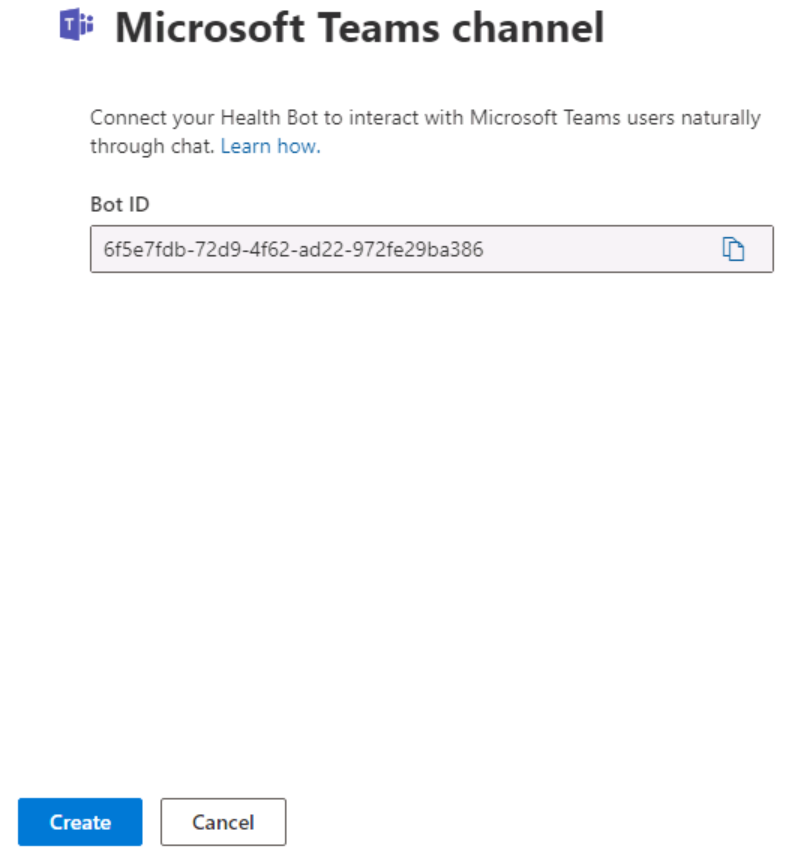

1. [] Select **Save**. This should enable Teams channel and your Microsoft Teams toggle should reflect accordingly.

    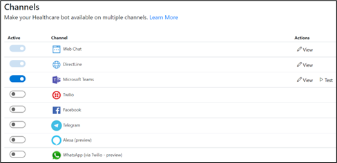

**Congratulations!** You completed the Azure Health Bot settings for integration with Microsoft Teams and Dynamics 365 Omnichannel for Customer Service.

## Exercise 2: Configure Virtual Clinic variables 

In this exercise, you will configure the Microsoft Cloud for Healthcare Virtual Clinic application.  The Virtual Clinic application allows practitioners to use video conferencing in Microsoft Teams to provide high-quality, personalized, and affordable consultations for their patients.

### Task 1: Create a new Azure app registration 

1. [] In Microsoft Edge, go to +++https://aad.portal.azure.com+++ 

1. [] In the left navigation, select **Azure Active Directory**. 

1. [] On the Overview page, under **Manage**, select **App registration**. 

1. [] In the **App registrations** pane, select **+ New registration**. 

1. [] Complete the application registration using the following information: 

    | Property | Value | 

    |---|---| 

    | Name | +++MCH Application+++ | 

    | Supported account types | Accounts in any organizational directory (Any Azure AD directory - Multitenant | 

    | Redirect URI (optional) > Select a platform | Web | 

1. [] Select **Register**.   

A URL is not required. 

## Task 2. Assign permissions to the MCH Application 

1. [] In the **MCH Application** pane, under **Manage**, select **API permissions**. 

1. [] Under **Configured permissions**, on the menu, select **+ Add a permission**. 

1. [] In the **Request API permissions** pane, select the **APIs my organization uses** tab. 

1. [] Locate and then select +++Dataverse+++. 

1. [] Select **Delegated permissions** and then, under **Permission**, select the **user_impersonation**. 

1. [] Select **Add permissions**. 

1. [] Select **+ Add a permission**. 

1. [] In the **Request API permissions** pane, select **Microsoft Graph**. 

1. [] Select **Application permissions**. 

1. [] Under **Select permissions**, expand **Calendars**. 

1. [] Select the **Calendars.ReadWrite** checkbox and then select **Add permissions**. 

1. [] Under **Configured permissions**, on the menu, select **Grant admin consent for Contoso**. 

1. [] In the **Grant admin consent confirmation** dialog box, select **Yes**.

### Task 3. Create a new client secret and record secret and app Id values 

1. [] In the resource menu under **Manage**, select **Certificate & secrets**. 

1. [] On the menu, select **+ New client secret**. 

1. [] In the **Add a client secret** pane, in the **Description** box, enter +++Lamna Healthcare app secret+++ and then select **Add**. 

1. [] In the **Value** column, select the **Copy to clipboard** icon to copy the secret value to the clipboard and then paste the secret value in the following text box: 

    @lab.TextBox(AppSecret) 

     >[!ALERT] You <u>**must**</u> record the secret value now. This value will be masked and not recoverable after you browse away from this page. You may also want to record this value in a text editor like Notepad to ensure you have a copy. 

1. [] In the resource menu, select **Overview**. 

1. [] To the right of **Application (client) ID**, select the **Copy to clipboard** icon to copy the secret value to the clipboard and then paste the secret value in the following text box: 

    @lab.TextBox(clientappid) 

### Task 4. Configure environment variables 

1. [] In Microsoft Edge, go to +++https://make.powerapps.com+++ 

1. [] In the left navigation, select **Apps**. 

1. [] In the warning banner, select **See environment variables**. 

1. [] In the **Environment variables** pane, in the **Virtual Visit Client ID** box, enter +++@lab.Variable(clientappid)+++ 

1. [] In the **Virtual Visit Secret** box, enter +++@lab.Variable(AppSecret)+++ 

1. [] In the **Virtual Appointment Scheduler Email** box, enter +++@lab.CloudCredential(WWLM365Enterprise2019wSPE_E).Username+++ 

1. [] Select **Save and close**. 

### Task 5. Activate Flows and connection references 

1. [] On the Power Apps page, in the left navigation, select **Solutions**. 

1. [] On the menu, select **+ New solution**. 

1. [] In the **New solution** pane, in the **Display name** box, enter +++LamnaHealthcare+++ 

1. [] Select the **Publisher** menu, select **CDS Default Publisher**, and then select **Create**. 

1. [] In the **Solutions** list, to the right of **LamnaHealthcare**, select the ellipsis and then select **Edit**. 

1. [] On the menu, select **Add existing** > **Automation** > **Cloud flow**. 

1. [] In the **Add existing cloud flows** pane, select **CF -> Schedule Teams Meeting for instant and virtual, update record with url and status booked** and then select **Add**. 

1. [] Hover over the cloud flow and then, on the left, select the checkbox. 

1. [] On the menu, select the **Edit** menu and then select **Edit in new tab**. 

    !IMAGE[solution-edit-in-new-tab-menu.png](solution-edit-in-new-tab-menu.png) 

1. [] In the **Welcome to Power Automate** dialog box, select **Get started**. 

1. [] To the right of **Microsoft Dataverse** select **Sign in**. 

1. [] To the right of **Office 365 Users** select **Sign in**. 

1. [] Select **Continue**. 

1. [] Review the new flow and then, in the top right menu, select **Save**. 

1. [] Close the **Edit your flow** browser tab. 

1. [] On the previous Power Apps tab, with the flow still selected, on the menu select **Turn on**. It may take 10-15 seconds for the flow to turn on and the page to refresh. 

1. [] When complete, in the left navigation, select **&larr; Back to solutions**.   

If the navigation menu is collapsed, you will use the left arrow icon. 

### Task 6: Obtain Azure Application ID

In this task, you will be using the Azure Application ID you created in Task 1 in our Azure tenant called “**MCH Application Id**”. Registering this Id establishes a trusted relationship between your Dynamics 365 app and the Microsoft identity platform. Using this Id, you will later create a Dynamics 365 Application User to bridge the authentication between Azure Health Bot and Power Apps.

1. [] Navigate back to the Azure Portal and search for +++**App Registrations**+++ in the **Search** box.

    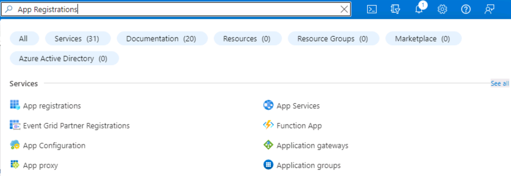

1. [] You will be landed in the **App registration** homepage on the Owned applications tab.

    

1. [] Select the **All applications** tab.

    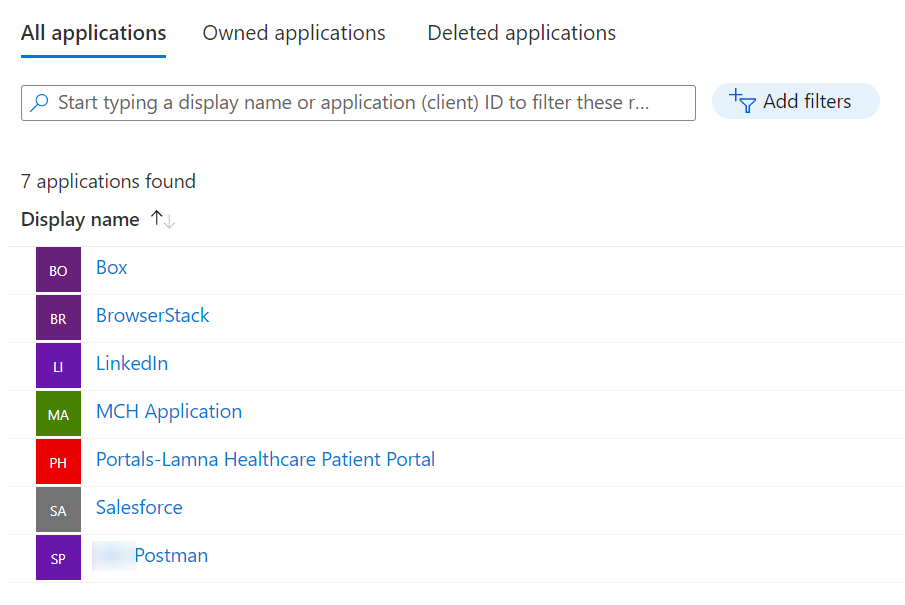

1. [] To search for our Application Id, type +++**MCH Application Id**+++ in the **Search** box.

    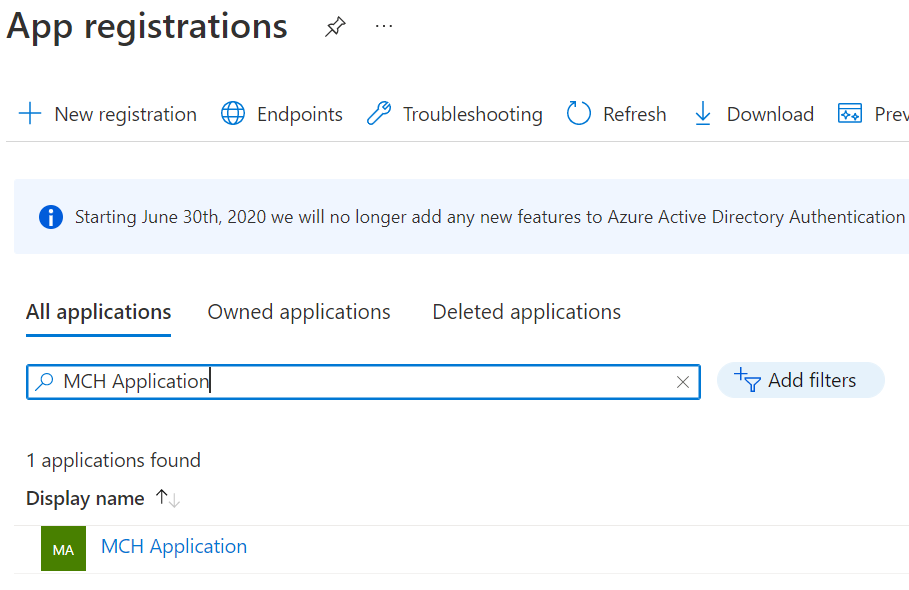

1. [] Select the **MCH Application Id** app registration resource. Copy and store the **Application (client) ID** for later to use when creating the Dynamics 365 Application User.

    > [!NOTE] Note: ID values have been removed in the screenshot for privacy purposes.

    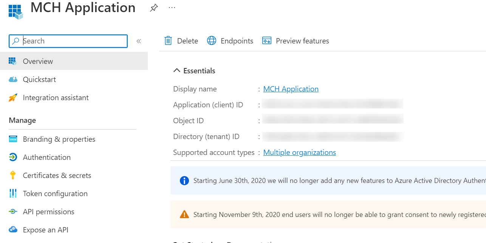

**Congratulations!** You have successfully obtained the MCH Application ID from Application Registrations in the Azure Portal.
